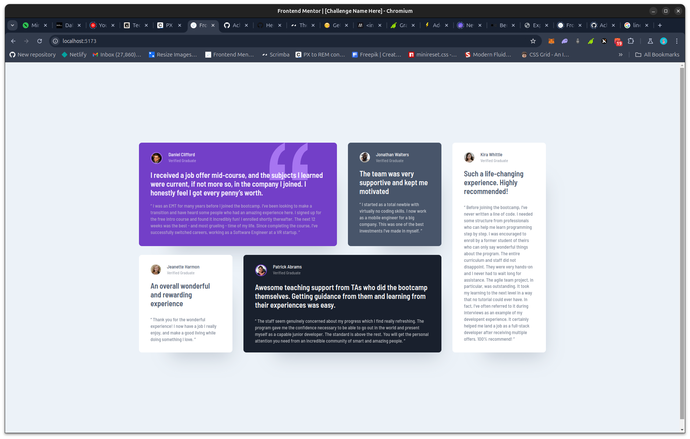

# Frontend Mentor - Testimonials grid section solution

This is a solution to the [Testimonials grid section challenge on Frontend Mentor](https://www.frontendmentor.io/challenges/testimonials-grid-section-Nnw6J7Un7). Frontend Mentor challenges help you improve your coding skills by building realistic projects. 

## Table of contents

- [Overview](#overview)
  - [Screenshot](#screenshot)
  - [Links](#links)
- [My process](#my-process)
  - [Built with](#built-with)
  - [What I learned](#what-i-learned)
  - [Useful resources](#useful-resources)
- [Author](#author)

## Overview

### Screenshot

### Links

- Solution URL: [Github Repo](https://github.com/Achigyus/testimonials-grid-section)
- Live Site URL: [Live Site](https://testimonials-grid-achigyus.netlify.app/)

## My process

### Built with

- Semantic HTML5 markup
- CSS custom properties
- Flexbox
- CSS Grid
- Mobile-first workflow
- [React](https://reactjs.org/) - JS library

### What I learned

I learned how to properly use CSS Grid to create fluid and responsive layouts.

### Useful resources

- [Grid By Example](https://gridbyexample.com/examples/) - This helped me to visualize how CSS Grid can be used to create complex but fluid/responsive layouts.
- [Interactive Guide to CSS Grid](https://www.joshwcomeau.com/css/interactive-guide-to-grid/) - This is an amazing article which helped me finally understand CSS Grid. I'd recommend it to anyone still learning this concept.

## Author

- Website - [Achigyus](https://github.com/Achigyus)
- Frontend Mentor - [@Achigyus](https://www.frontendmentor.io/profile/Achigyus)
- Twitter - [@ElUchihaAnbu](https://www.twitter.com/ElUchihaAnbu)
